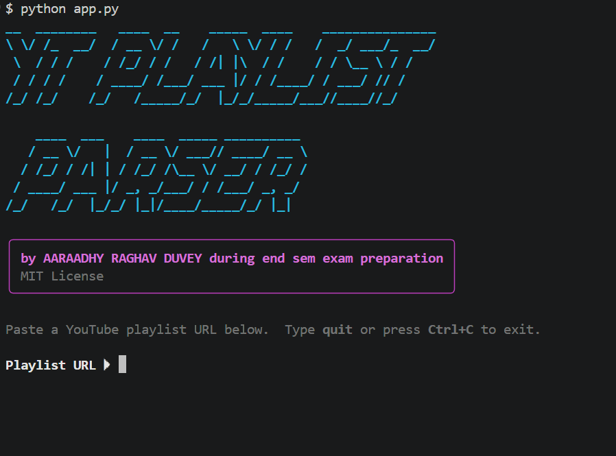
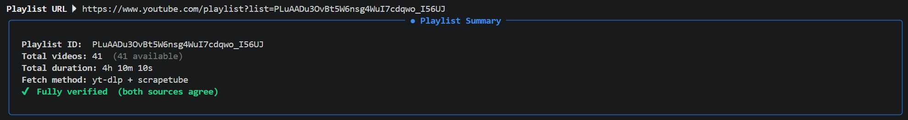
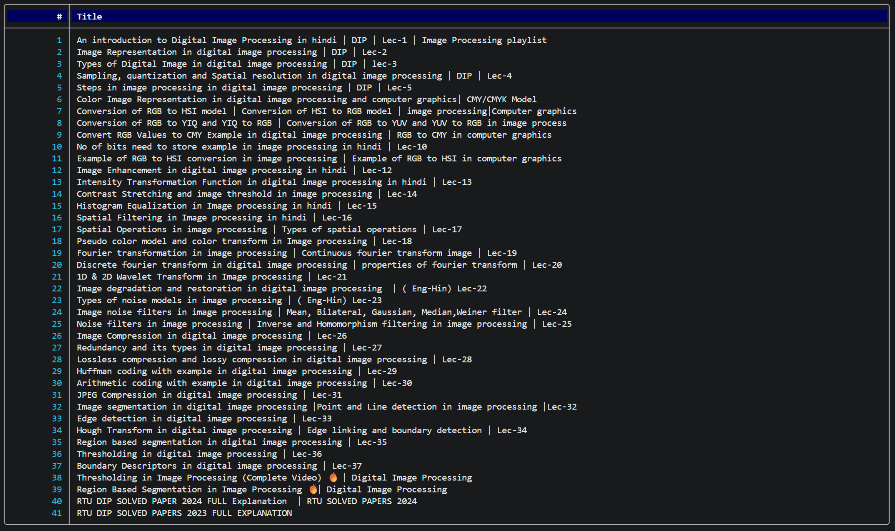
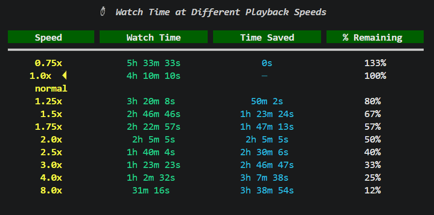

# 📺 YouTube Playlist Parser

> Fetch, verify, analyze, and export YouTube playlist metadata — right from your terminal.




---

## ✨ Features

| Feature | Detail |
|---|---|
| **Dual-source fetching** | `yt-dlp` (primary) + `scrapetube` (secondary) run in parallel |
| **Cross-verification** | Title match-rate analysis + total duration cross-check between sources |
| **Concurrent fetching** | Both sources run simultaneously via `ThreadPoolExecutor` — ~2× faster |
| **Speed table** | Watch-time estimates at 0.75×, 1×, 1.25×, 1.5×, 1.75×, 2×, 2.5×, 3×, 4×, 8× |
| **Per-video durations** | Optional `--durations` flag adds a duration column to the video table |
| **Export** | Full metadata export to `JSON` or `CSV` with timestamps and speed estimates |
| **Graceful fallback** | Single-source mode kicks in automatically if one method fails |
| **Beautiful TUI** | Rich tables, panels, progress spinners, and colour via `rich` |
| **CLI flags** | `--url`, `--export`, `--durations`, `--debug`, `--version` |

---

## 📦 Installation

```bash
# 1. Clone the repository
git clone https://github.com/aaraadhy/yt-playlist-parser.git
cd yt-playlist-parser

# 2. (Recommended) Create a virtual environment
python -m venv venv
source venv/bin/activate        # Linux / macOS
venv\Scripts\activate           # Windows

# 3. Install dependencies
pip install -r requirements.txt
```

---

## 🚀 Usage

### Interactive mode
```bash
python yt_playlist_parser.py
```

### Direct URL (non-interactive)
```bash
python yt_playlist_parser.py --url "https://youtube.com/playlist?list=PLxxxx"
```

### With per-video durations
```bash
python yt_playlist_parser.py --url "..." --durations
```

### Export to JSON
```bash
python yt_playlist_parser.py --url "..." --export json
```

### Export to CSV
```bash
python yt_playlist_parser.py --url "..." --export csv --durations
```

### Debug mode (verbose logging)
```bash
python yt_playlist_parser.py --debug
```

---

## 🖼️ Terminal Preview

### URL input and playlist details



### Scraped video titles list



### Playback speed table



---

## 📋 CLI Reference

```
usage: yt-playlist-parser [-h] [--url URL] [--export {json,csv}]
                           [--durations] [--debug] [--version]

options:
  -h, --help               Show this help message and exit
  --url, -u URL            YouTube playlist URL (skips the interactive prompt)
  --export, -e FORMAT      Export results: json or csv
  --durations, -d          Show per-video durations in the table
  --debug                  Enable verbose debug-level logging
  --version, -v            Show version and exit
```

---

## 📁 Export Format

### JSON (`playlist_<id>_<timestamp>.json`)
```json
{
  "meta": {
    "playlist_id": "PLxxxx",
    "url": "https://youtube.com/playlist?list=PLxxxx",
    "fetched_at": "2025-01-01T12:00:00",
    "fetch_method": "yt-dlp + scrapetube",
    "verified": true,
    "generator": "yt-playlist-parser v1.0"
  },
  "stats": {
    "video_count": 42,
    "available_count": 41,
    "total_duration_seconds": 18300,
    "total_duration_formatted": "5h 5m 0s"
  },
  "speed_estimates": {
    "1.0x": "5h 5m 0s",
    "1.5x": "3h 23m 20s",
    "2.0x": "2h 32m 30s"
  },
  "videos": [ ... ]
}
```

### CSV (`playlist_<id>_<timestamp>.csv`)
```
index,title,video_id,duration_seconds,duration_formatted,available,source
1,Video Title Here,dQw4w9WgXcQ,212,3m 32s,True,yt-dlp
...
```

---

## 🏗️ Architecture

```
process_playlist()                     ← main pipeline
│
├── extract_playlist_id()              ← URL parsing & validation
├── validate_playlist_id()             ← structural sanity check
│
├── ThreadPoolExecutor (2 workers)
│   ├── fetch_with_ytdlp()            ← bulk metadata via yt-dlp
│   └── fetch_with_scrapetube()       ← lazy generator via scrapetube
│
├── verify_and_merge()                 ← cross-verify titles + durations
│
├── display_results()                  ← Rich table + info panel
│   └── display_speed_table()         ← playback speed estimates
│
└── handle_export()                    ← JSON / CSV export
    ├── export_json()
    └── export_csv()
```

---

## 🔧 How Cross-Verification Works

1. **Length check** — both sources must return the same number of videos
2. **Title match rate** — positional comparison; warns if >10% of titles differ
3. **Duration cross-check** — warns if total duration disagrees by more than 60 seconds

If either source fails, the tool falls back to single-source mode automatically. The primary source is always `yt-dlp`; `scrapetube` is used purely for verification.

---

## 🛠️ Why `yt-dlp` instead of `pytube`?

`pytube` is largely unmaintained and regularly breaks due to YouTube's cipher changes. `yt-dlp` is the community-maintained fork of `youtube-dl`, updated frequently, and fetches all playlist metadata in a **single bulk request** using `extract_flat=True` — no per-video HTTP calls.

---

## 📋 Requirements

- `Python 3.8+`
- `yt-dlp >= 2024.1.1`
- `scrapetube >= 2.5.1`
- `pyfiglet >= 1.0.2`
- `rich >= 13.7.0`

---

## 🤝 Contributing

Pull requests are welcome. For major changes, please open an issue first to discuss what you'd like to change.

---

## 📄 License

[MIT](LICENSE) © Aaraadhy Raghav Duvey

---

*Built during end-sem exam season — because procrastination is most productive when it's also useful.*